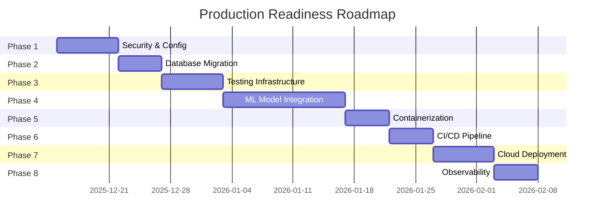

# CardioVoice Backend - Future Perspectives & Production Roadmap

> **Created**: December 14, 2025  
> **Last Updated**: December 14, 2025 20:55  
> **Status**: 🚧 Phase 2 Complete - In Progress

---

## 📌 Document Purpose

This document outlines a comprehensive, stepwise plan to transform the CardioVoice Backend from its current **MVP state** to a **production-ready, deployable system**. Each phase contains trackable tasks with checkboxes that should be updated as implementation progresses.

---

## 🎯 Production Readiness Goals

| Goal | Current State | Target State |
|------|---------------|--------------|
| **Reliability** | Single-process Flask | Containerized, scalable |
| **Security** | No auth, disabled SSL | Full auth, secure connections |
| **Data Persistence** | JSON file | PostgreSQL database |
| **ML Capability** | Mock heuristics | Real voice analysis model |
| **Testing** | None | 80%+ coverage |
| **Observability** | Basic logging | Metrics, tracing, alerting |
| **Deployment** | Local only | CI/CD pipeline, cloud hosting |

---

## 📊 Implementation Phases Overview



---

# ✅ Phase 1: Security & Configuration Hardening

**Priority**: 🔴 Critical  
**Estimated Duration**: 5-7 days  
**Status**: ✅ **COMPLETED** (2025-12-14)

## Objectives
Secure the application, implement authentication, and fix security vulnerabilities.

## Tasks

### 1.1 Authentication & Authorization
- [x] Choose auth strategy (JWT, OAuth2, API Keys) → **JWT chosen**
- [x] Implement user registration endpoint → `POST /api/v1/auth/register`
- [x] Implement login endpoint with token generation → `POST /api/v1/auth/login`
- [x] Add authentication middleware for protected routes → `@require_auth` decorator
- [ ] Implement role-based access control (RBAC) if needed *(deferred to future)*
- [x] Add rate limiting per user/IP → flask-limiter (100/min global)

**Files Created/Modified**:
- `services/auth_service.py` - JWT auth with bcrypt password hashing
- `middleware/auth_middleware.py` - `@require_auth` decorator
- `schemas.py` - UserRegisterModel, UserLoginModel, TokenResponseModel
- `app.py` - Auth routes registered

### 1.2 SSL/TLS Security
- [x] Enable SSL verification for GigaChat API calls
- [ ] Configure HTTPS for production *(requires deployment)*
- [x] Update `verify_ssl_certs=False` → Configurable via `VERIFY_SSL` env var
- [ ] Add SSL certificate configuration *(requires deployment)*

**Files Modified**:
- `services/chat_ai.py` - Now uses `settings.verify_ssl`

### 1.3 Environment & Secrets Management
- [x] Create `.env.example` template (without secrets)
- [x] Add `.env` to `.gitignore`
- [x] Implement secrets validation on startup → Pydantic Settings
- [ ] Consider using a secrets manager *(future enhancement)*
- [x] Document all required environment variables → In `.env.example`

**Files Created**:
- `.env.example` - Complete template with all variables
- `.gitignore` - Comprehensive patterns
- `config.py` - Pydantic Settings with validation

### 1.4 Input Validation Hardening
- [x] Add file size limits for audio uploads → Configurable via `MAX_UPLOAD_SIZE_MB`
- [x] Implement content-type validation → MIME type checking
- [x] Add request payload size limits → `MAX_CONTENT_LENGTH` in Flask
- [x] Sanitize all user inputs → Pydantic validation

**Files Modified**:
- `utils.py` - `validate_file_size()`, `validate_content_type()`
- `app.py` - `MAX_CONTENT_LENGTH` configured

### 1.5 Security Headers
- [x] Add Helmet-like security headers
- [x] Implement Content-Security-Policy
- [x] Add X-Content-Type-Options: nosniff
- [x] Add X-Frame-Options: DENY

**Files Created**:
- `middleware/security_headers.py` - All security headers

---

# ✅ Phase 2: Database Migration

**Priority**: 🔴 Critical  
**Estimated Duration**: 5-7 days  
**Status**: ✅ **COMPLETED** (2025-12-14)

## Objectives
Replace JSON file storage with a proper database for scalability and data integrity.

## Tasks

### 2.1 Database Setup
- [ ] Choose database (PostgreSQL recommended)
- [ ] Set up local development database
- [ ] Create database connection module
- [ ] Implement connection pooling

**Files to Create**:
- `database/connection.py` - DB connection
- `database/__init__.py` - Module init

### 2.2 Schema Design
- [ ] Design users table
- [ ] Design analysis_sessions table
- [ ] Design supplements table (migrate from JSON)
- [ ] Design conditions table
- [ ] Create entity relationship diagram

**Proposed Schema**:
```sql
-- users
CREATE TABLE users (
    id UUID PRIMARY KEY,
    email VARCHAR(255) UNIQUE,
    password_hash VARCHAR(255),
    created_at TIMESTAMP,
    updated_at TIMESTAMP
);

-- profiles
CREATE TABLE profiles (
    id UUID PRIMARY KEY,
    user_id UUID REFERENCES users(id),
    age INTEGER,
    gender VARCHAR(10),
    smoking_status VARCHAR(20),
    activity_level VARCHAR(20)
);

-- analysis_sessions
CREATE TABLE analysis_sessions (
    id UUID PRIMARY KEY,
    user_id UUID REFERENCES users(id),
    audio_file_path VARCHAR(500),
    risk_scores JSONB,
    ai_explanation TEXT,
    created_at TIMESTAMP
);

-- supplements
CREATE TABLE supplements (
    id UUID PRIMARY KEY,
    condition VARCHAR(50),
    name VARCHAR(255),
    dosage VARCHAR(100),
    mechanism TEXT,
    keywords TEXT[],
    warnings TEXT
);
```

### 2.3 ORM Implementation
- [ ] Choose ORM (SQLAlchemy recommended)
- [ ] Create database models
- [ ] Implement migrations (Alembic)
- [ ] Create seed script for supplements data

**Files to Create**:
- `models/user.py`
- `models/profile.py`
- `models/analysis.py`
- `models/supplement.py`
- `migrations/` - Alembic directory

### 2.4 Data Migration
- [ ] Create migration script from JSON → DB
- [ ] Migrate knowledge_base.json to supplements table
- [ ] Verify data integrity post-migration
- [ ] Update KnowledgeBaseService to use DB

**Files to Modify**:
- `services/kb.py` - Use DB instead of JSON

### 2.5 Update Dependencies
- [ ] Add `SQLAlchemy` to requirements.txt
- [ ] Add `alembic` for migrations
- [ ] Add `psycopg2-binary` for PostgreSQL
- [ ] Add `asyncpg` if using async

---

# 🧪 Phase 3: Testing Infrastructure

**Priority**: 🟠 High  
**Estimated Duration**: 7-10 days  
**Status**: [ ] Not Started

## Objectives
Establish comprehensive testing to ensure reliability and catch regressions.

## Tasks

### 3.1 Testing Setup
- [ ] Add pytest and testing dependencies
- [ ] Create test directory structure
- [ ] Set up test configuration
- [ ] Create test fixtures
- [ ] Set up test database

**Files to Create**:
```
tests/
├── __init__.py
├── conftest.py           # Pytest fixtures
├── test_config.py        # Test configuration
├── unit/
│   ├── test_schemas.py
│   ├── test_utils.py
│   └── services/
│       ├── test_kb.py
│       ├── test_ml.py
│       └── test_chat_ai.py
├── integration/
│   ├── test_analyze.py
│   └── test_health.py
└── e2e/
    └── test_full_flow.py
```

### 3.2 Unit Tests
- [ ] Test ProfileModel validation (schemas.py)
- [ ] Test file upload utilities (utils.py)
- [ ] Test KnowledgeBaseService retrieval
- [ ] Test MockMLService risk calculation
- [ ] Test CardioChatService prompt building
- [ ] Test CardioChatService mock mode

### 3.3 Integration Tests
- [ ] Test /api/v1/analyze endpoint happy path
- [ ] Test /api/v1/analyze with invalid data
- [ ] Test /health endpoint
- [ ] Test CORS headers
- [ ] Test request ID propagation

### 3.4 End-to-End Tests
- [ ] Test complete analysis flow
- [ ] Test with mock audio file
- [ ] Test rate limiting
- [ ] Test authentication flow (after Phase 1)

### 3.5 Coverage & Quality
- [ ] Configure pytest-cov for coverage
- [ ] Set minimum coverage threshold (80%)
- [ ] Add pre-commit hooks for tests
- [ ] Create coverage badge for README

**Dependencies to Add**:
```
pytest==8.x
pytest-cov==4.x
pytest-asyncio==0.x
httpx[test]==0.x
factory-boy==3.x
```

---

# 🤖 Phase 4: ML Model Integration

**Priority**: 🟠 High  
**Estimated Duration**: 14-21 days  
**Status**: [ ] Not Started

## Objectives
Replace mock ML service with real voice analysis capabilities.

## Tasks

### 4.1 Audio Processing Pipeline
- [ ] Research voice biomarker extraction techniques
- [ ] Implement audio format normalization
- [ ] Add audio preprocessing (noise reduction, etc.)
- [ ] Extract acoustic features (MFCC, spectrograms, etc.)
- [ ] Handle different audio formats consistently

**Files to Create**:
- `services/audio_processor.py`
- `services/feature_extractor.py`

### 4.2 ML Model Research
- [ ] Research existing voice health analysis models
- [ ] Evaluate pretrained models available
- [ ] Consider: wav2vec, HuBERT, custom CNN/RNN
- [ ] Define model input/output specifications
- [ ] Create model evaluation criteria

### 4.3 Model Development/Integration
- [ ] Option A: Train custom model
  - [ ] Gather training dataset
  - [ ] Train and validate model
  - [ ] Export model for inference
- [ ] Option B: Use pretrained model
  - [ ] Download/integrate pretrained weights
  - [ ] Fine-tune if necessary
  - [ ] Validate on test dataset

### 4.4 Inference Service
- [ ] Create MLService interface
- [ ] Implement model loading and caching
- [ ] Add GPU/CPU inference support
- [ ] Implement batch processing if needed
- [ ] Add model versioning

**Files to Create/Modify**:
- `services/ml.py` - Replace mock with real
- `services/ml_model.py` - Model wrapper
- `models/` - Store model files

### 4.5 Model Serving Options
- [ ] Option 1: In-process inference (simple)
- [ ] Option 2: Separate model server (TorchServe, TensorFlow Serving)
- [ ] Option 3: Cloud ML (Vertex AI, SageMaker)
- [ ] Document chosen approach

---

# 🐳 Phase 5: Containerization

**Priority**: 🟡 Medium  
**Estimated Duration**: 3-5 days  
**Status**: [ ] Not Started

## Objectives
Package the application in containers for consistent deployment.

## Tasks

### 5.1 Docker Setup
- [ ] Create production Dockerfile
- [ ] Create development Dockerfile
- [ ] Optimize image size (multi-stage builds)
- [ ] Configure non-root user
- [ ] Add health check

**Files to Create**:
```dockerfile
# Dockerfile
FROM python:3.11-slim as base
...

# Dockerfile.dev
FROM python:3.11 as development
...
```

### 5.2 Docker Compose
- [ ] Create docker-compose.yml for local dev
- [ ] Add database service (PostgreSQL)
- [ ] Add Redis for caching (optional)
- [ ] Configure volumes for development
- [ ] Add network configuration

**Files to Create**:
- `docker-compose.yml`
- `docker-compose.prod.yml`
- `.dockerignore`

### 5.3 Container Configuration
- [ ] Externalize all configuration
- [ ] Use environment variables properly
- [ ] Configure logging for containers
- [ ] Set resource limits
- [ ] Configure restart policies

### 5.4 Image Registry
- [ ] Choose registry (Docker Hub, GCR, ECR, GHCR)
- [ ] Set up image tagging strategy
- [ ] Configure automated builds
- [ ] Document image naming conventions

---

# 🔄 Phase 6: CI/CD Pipeline

**Priority**: 🟡 Medium  
**Estimated Duration**: 5-7 days  
**Status**: [ ] Not Started

## Objectives
Automate testing, building, and deployment.

## Tasks

### 6.1 Version Control Hygiene
- [ ] Create comprehensive .gitignore
- [ ] Set up branch protection rules
- [ ] Define branching strategy (GitFlow, trunk-based)
- [ ] Create PR template
- [ ] Add CODEOWNERS file

### 6.2 CI Pipeline (GitHub Actions / GitLab CI)
- [ ] Run linting (flake8, black, isort)
- [ ] Run type checking (mypy)
- [ ] Run unit tests
- [ ] Run integration tests
- [ ] Generate coverage report
- [ ] Build Docker image
- [ ] Scan for vulnerabilities (Snyk, Trivy)

**Files to Create**:
```yaml
# .github/workflows/ci.yml
name: CI Pipeline
on: [push, pull_request]
jobs:
  lint:
    ...
  test:
    ...
  build:
    ...
  security-scan:
    ...
```

### 6.3 CD Pipeline
- [ ] Deploy to staging on merge to develop
- [ ] Deploy to production on merge to main
- [ ] Implement blue-green or rolling deployment
- [ ] Add rollback capability
- [ ] Configure deployment notifications

### 6.4 Quality Gates
- [ ] Minimum test coverage: 80%
- [ ] No critical security vulnerabilities
- [ ] All tests passing
- [ ] Code review approved
- [ ] Documentation updated

---

# ☁️ Phase 7: Cloud Deployment

**Priority**: 🟡 Medium  
**Estimated Duration**: 7-10 days  
**Status**: [ ] Not Started

## Objectives
Deploy to production cloud infrastructure.

## Tasks

### 7.1 Cloud Provider Selection
- [ ] Evaluate options (AWS, GCP, Azure, DigitalOcean)
- [ ] Consider cost, scalability, managed services
- [ ] Document decision and rationale
- [ ] Set up cloud account and billing

### 7.2 Infrastructure as Code
- [ ] Choose IaC tool (Terraform, Pulumi, CloudFormation)
- [ ] Define VPC/network configuration
- [ ] Configure managed database (RDS, Cloud SQL)
- [ ] Set up load balancer
- [ ] Configure auto-scaling

**Files to Create**:
```
infrastructure/
├── terraform/
│   ├── main.tf
│   ├── variables.tf
│   ├── outputs.tf
│   └── modules/
│       ├── networking/
│       ├── database/
│       ├── compute/
│       └── storage/
```

### 7.3 Kubernetes (Optional)
- [ ] Evaluate if K8s is necessary for scale
- [ ] Create Kubernetes manifests
- [ ] Set up Helm charts
- [ ] Configure horizontal pod autoscaler
- [ ] Set up ingress controller

**Files to Create** (if using K8s):
```
k8s/
├── namespace.yaml
├── deployment.yaml
├── service.yaml
├── ingress.yaml
├── configmap.yaml
├── secrets.yaml
└── hpa.yaml
```

### 7.4 Domain & SSL
- [ ] Register/configure domain
- [ ] Set up DNS records
- [ ] Configure SSL certificates (Let's Encrypt, ACM)
- [ ] Set up CDN if needed

### 7.5 Backup & Disaster Recovery
- [ ] Configure database backups
- [ ] Set up backup retention policy
- [ ] Document recovery procedures
- [ ] Test backup restoration

---

# 📈 Phase 8: Observability & Monitoring

**Priority**: 🟢 Medium  
**Estimated Duration**: 5-7 days  
**Status**: [ ] Not Started

## Objectives
Implement comprehensive monitoring, logging, and alerting.

## Tasks

### 8.1 Structured Logging Enhancement
- [ ] Standardize log format (already JSON)
- [ ] Add log levels appropriately
- [ ] Include correlation IDs consistently
- [ ] Configure log aggregation (ELK, CloudWatch, Loki)
- [ ] Set up log retention policies

### 8.2 Metrics Collection
- [ ] Add Prometheus metrics endpoint
- [ ] Track request latency
- [ ] Track request count by endpoint
- [ ] Track error rates
- [ ] Track GigaChat API latency
- [ ] Track ML inference time

**Dependencies to Add**:
```
prometheus-flask-exporter==0.x
```

### 8.3 Distributed Tracing
- [ ] Implement OpenTelemetry
- [ ] Add trace context propagation
- [ ] Configure trace sampling
- [ ] Set up trace visualization (Jaeger, Zipkin)

### 8.4 Dashboards
- [ ] Create Grafana dashboards (or cloud equivalent)
- [ ] Build overview dashboard
- [ ] Build API performance dashboard
- [ ] Build error tracking dashboard
- [ ] Build infrastructure dashboard

### 8.5 Alerting
- [ ] Define SLOs (Service Level Objectives)
- [ ] Create alerting rules
- [ ] Set up notification channels (Slack, PagerDuty)
- [ ] Create on-call schedule
- [ ] Document incident response procedures

### 8.6 Health Checks
- [ ] Enhance /health endpoint with dependencies
- [ ] Add database connectivity check
- [ ] Add GigaChat API connectivity check
- [ ] Add readiness vs liveness probes

---

# 📚 Phase 9: Documentation & Developer Experience

**Priority**: 🟢 Low  
**Estimated Duration**: 3-5 days  
**Status**: [ ] Not Started

## Objectives
Comprehensive documentation for users and developers.

## Tasks

### 9.1 API Documentation
- [ ] Keep OpenAPI spec updated
- [ ] Add request/response examples
- [ ] Document error codes
- [ ] Add authentication documentation
- [ ] Create Postman collection

### 9.2 Developer Documentation
- [ ] Create README.md with setup instructions
- [ ] Add CONTRIBUTING.md guidelines
- [ ] Create architecture documentation
- [ ] Document deployment procedures
- [ ] Add troubleshooting guide

### 9.3 Code Documentation
- [ ] Add docstrings to all public functions
- [ ] Generate API docs (Sphinx, pdoc)
- [ ] Add inline comments for complex logic
- [ ] Create code style guide

### 9.4 Runbooks
- [ ] Create deployment runbook
- [ ] Create rollback runbook
- [ ] Create incident response runbook
- [ ] Create database migration runbook

---

# 🔧 Additional Improvements

## Performance Optimization
- [ ] Implement response caching (Redis)
- [ ] Add database query optimization
- [ ] Implement async processing for heavy tasks
- [ ] Add connection pooling
- [ ] Profile and optimize hot paths

## API Versioning
- [ ] Implement proper API versioning strategy
- [ ] Plan deprecation policy
- [ ] Document version lifecycle

## Internationalization
- [ ] Support multiple languages (beyond Russian)
- [ ] Externalize strings
- [ ] Add language detection

---

# 📋 Quick Reference: Priority Order

1. 🔴 **Phase 1**: Security & Configuration (CRITICAL - do first)
2. 🔴 **Phase 2**: Database Migration (CRITICAL - data foundation)
3. 🟠 **Phase 3**: Testing Infrastructure (HIGH - quality assurance)
4. 🟠 **Phase 4**: ML Model Integration (HIGH - core feature)
5. 🟡 **Phase 5**: Containerization (MEDIUM - deployment prep)
6. 🟡 **Phase 6**: CI/CD Pipeline (MEDIUM - automation)
7. 🟡 **Phase 7**: Cloud Deployment (MEDIUM - go live)
8. 🟢 **Phase 8**: Observability (MEDIUM - operational excellence)
9. 🟢 **Phase 9**: Documentation (LOW - ongoing)

---

# 📊 Progress Tracker

| Phase | Status | Started | Completed | Notes |
|-------|--------|---------|-----------|-------|
| Phase 1: Security | ✅ Completed | 2025-12-14 12:15 | 2025-12-14 12:35 | JWT auth, rate limiting, security headers |
| Phase 2: Database | ✅ Completed | 2025-12-14 20:48 | 2025-12-14 20:55 | PostgreSQL + pgvector, SQLAlchemy models |
| Phase 3: Testing | ⬜ Not Started | - | - | - |
| Phase 4: ML Model | ⬜ Not Started | - | - | - |
| Phase 5: Docker | ⬜ Not Started | - | - | - |
| Phase 6: CI/CD | ⬜ Not Started | - | - | - |
| Phase 7: Cloud | ⬜ Not Started | - | - | - |
| Phase 8: Observability | ⬜ Not Started | - | - | - |
| Phase 9: Documentation | ⬜ Not Started | - | - | - |

**Legend**: ⬜ Not Started | 🟡 In Progress | ✅ Completed | ⏸️ Blocked

---

# 📝 Change Log

| Date | Phase | Change | By |
|------|-------|--------|-----|
| 2025-12-14 12:07 | - | Initial future perspectives document created | AI Assistant |
| 2025-12-14 12:35 | Phase 1 | **COMPLETED** - JWT auth, rate limiting, security headers, input validation | AI Assistant |

---

*This document should be updated as each task is completed. Mark tasks with [x] when done and update the Progress Tracker table accordingly.*
