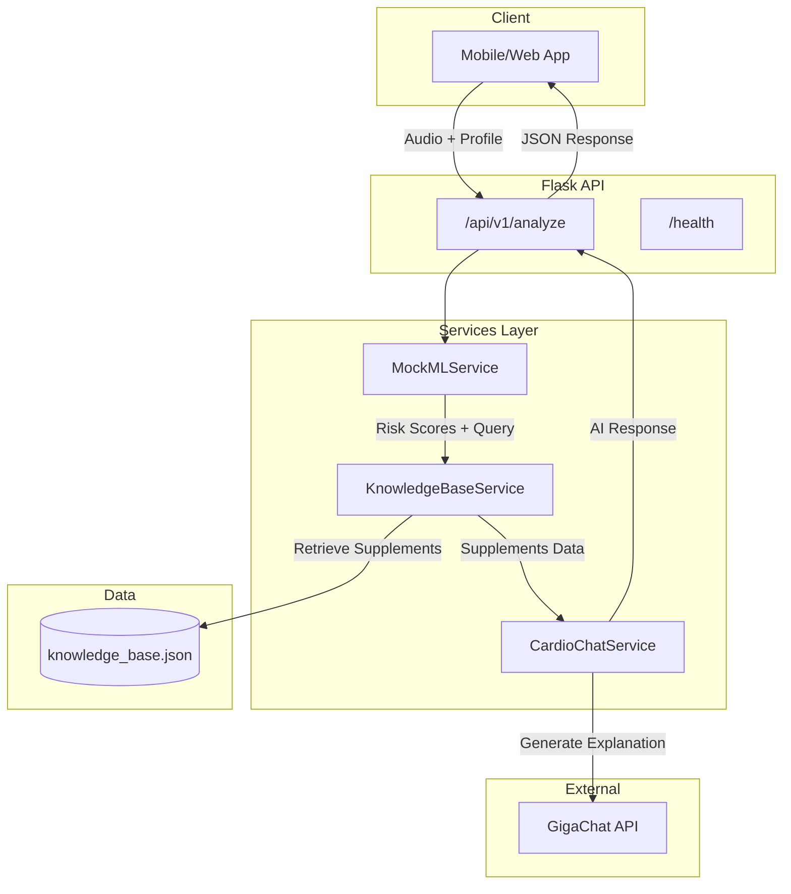

# CardioVoice Backend - Initial State Analysis

> **Analysis Date**: December 14, 2025  
> **Project Status**: MVP / Early Development Stage

---

## 📋 Executive Summary

**CardioVoice** is a health risk assessment backend API that combines voice analysis, user profiling, and AI-generated health recommendations. The system analyzes cardiovascular risk factors and provides personalized nutrition/supplement suggestions in **Russian language**.

The backend is built on **Flask** with **GigaChat** (Russian LLM by Sber) integration and uses a RAG (Retrieval-Augmented Generation) approach for supplement recommendations.

---

## 🏗️ Architecture Overview



### Request Flow

1. **Client** sends audio file + user profile (age, gender, smoking, activity)
2. **MockMLService** generates risk scores (АГ, СД2, ИБС) and a search query
3. **KnowledgeBaseService** retrieves relevant supplements via keyword matching (RAG-lite)
4. **CardioChatService** generates Russian-language health explanation using GigaChat
5. **API** returns risk scores + AI explanation to client

---

## 🛠️ Tech Stack

| Layer | Technology | Purpose |
|-------|------------|---------|
| **Framework** | Flask 3.1.2 | REST API server |
| **Validation** | Pydantic 2.11 | Request/schema validation |
| **AI/LLM** | GigaChat 0.1.42 | Russian language LLM (Sber) |
| **CORS** | Flask-CORS 6.0.1 | Cross-origin security |
| **Docs** | Flask-Swagger-UI 5.21 | OpenAPI documentation at `/docs` |
| **HTTP** | httpx 0.28 | Async HTTP client |
| **Config** | python-dotenv | Environment management |

### Key Dependencies

```
Flask==3.1.2
pydantic==2.11.9  
gigachat==0.1.42.post2
flask-cors==6.0.1
flask-swagger-ui==5.21.0
```

---

## 📁 Project Structure

```
Backend/
├── app.py                  # Main Flask application & routes
├── schemas.py              # Pydantic validation models
├── utils.py                # File upload utilities
├── knowledge_base.json     # Supplement/nutrient database (Russian)
├── requirements.txt        # Python dependencies
├── .env                    # Environment variables (API keys)
│
├── services/
│   ├── __init__.py         # Service exports
│   ├── chat_ai.py          # GigaChat integration service
│   ├── kb.py               # Knowledge base RAG service
│   └── ml.py               # Mock ML risk scoring service
│
├── static/
│   └── openapi.yaml        # OpenAPI 3.0 specification
│
├── docs/                   # Empty (for future documentation)
└── temp_uploads/           # Temporary audio file storage
```

---

## 🔌 API Structure

### Endpoints

| Method | Endpoint | Description |
|--------|----------|-------------|
| `POST` | `/api/v1/analyze` | Main analysis endpoint |
| `GET` | `/health` | Health check (returns mode: mock/real) |
| `GET` | `/docs` | Swagger UI documentation |
| `GET` | `/openapi.yaml` | OpenAPI specification |

### `/api/v1/analyze` Request

```yaml
Content-Type: multipart/form-data

Fields:
  - age: integer (18-100)
  - gender: "male" | "female"
  - smoking_status: "smoker" | "non-smoker"
  - activity_level: "sedentary" | "moderate" | "active"
  - audio: binary (wav, mp3, m4a, ogg)
```

### `/api/v1/analyze` Response

```json
{
  "status": "success",
  "data": {
    "risk_scores": {
      "АГ (Гипертензия)": 0.45,
      "СД2 (Диабет)": 0.12,
      "ИБС (Сердце)": 0.30
    },
    "ai_explanation": "Краткий вывод: ..."
  }
}
```

---

## 💾 Database Schema

> **Note**: No traditional database is used. Data is stored in a JSON file.

### Knowledge Base Structure (`knowledge_base.json`)

```json
[
  {
    "condition": "АГ | СД2 | ИБС | Пост-ОИМ",
    "supplements": [
      {
        "name": "Supplement Name (Brand)",
        "dosage": "Recommended dosage",
        "mechanism": "How it helps (Russian)",
        "keywords": ["search", "terms", "for", "matching"],
        "warnings": "Precautions (Russian)"
      }
    ]
  }
]
```

### Conditions Covered

| Condition | Russian Name | English |
|-----------|--------------|---------|
| АГ | Артериальная гипертензия | Hypertension |
| СД2 | Сахарный диабет 2 типа | Type 2 Diabetes |
| ИБС | Ишемическая болезнь сердца | Ischemic Heart Disease |
| Пост-ОИМ | Пост-инфаркт | Post-Myocardial Infarction |

### User Profile Model

```python
class ProfileModel(BaseModel):
    age: int           # 18-100
    gender: Literal["male", "female"]
    smoking_status: Literal["smoker", "non-smoker"]
    activity_level: Literal["sedentary", "moderate", "active"]
```

---

## 🔧 Services Architecture

### 1. MockMLService (`services/ml.py`)

**Purpose**: Generates mock cardiovascular risk scores

**Current State**: Uses heuristic-based mock data (no real ML model yet)

```python
# Risk calculation factors:
- Base IHD risk increases with age
- 1.2x multiplier for male gender
- 1.5x multiplier for smokers
- 1.3x multiplier for sedentary lifestyle

# Outputs:
- Risk scores for АГ, СД2, ИБС (0.0-1.0)
- Search query for knowledge base lookup
```

---

### 2. KnowledgeBaseService (`services/kb.py`)

**Purpose**: RAG-style supplement retrieval

**Key Features**:
- Tokenization with Russian/English support
- Synonym expansion for medical terms
- Weighted scoring (name: 5pt, keywords: 3pt, mechanism: 1pt)
- Returns top-k (default: 5) supplements

**Synonym Mapping**:
```python
synonyms = {
    "усталость": ["энергия", "митохондрии", "атф", "coq10", "l-карнитин"],
    "давление": ["аг", "гипертензия", "сосуды", "магний", "вазодилатация"],
    "сердце": ["миокард", "ибс", "кардио", "ритм", "таурин", "омега"],
    # ... more mappings
}
```

---

### 3. CardioChatService (`services/chat_ai.py`)

**Purpose**: AI explanation generation via GigaChat

**Operating Modes**:
- **Mock Mode**: Returns deterministic fallback response (no API key)
- **Real Mode**: Calls GigaChat API with timeout protection (8 seconds)

**Prompt Structure**:
1. Role definition as "CardioVoice AI Coach"
2. User profile injection (age, gender, smoking, activity)
3. Risk level identification
4. Supplement list from knowledge base
5. Instructions for personalized response
6. Disclaimer requirement

---

## ⚙️ Configuration

### Environment Variables

| Variable | Required | Description |
|----------|----------|-------------|
| `GIGACHAT_AUTH_KEY` | No* | GigaChat API credentials |
| `FLASK_ENV` | No | `development` or `production` |
| `ALLOWED_ORIGINS` | Prod | Comma-separated CORS origins |
| `CORS_CREDENTIALS` | No | Enable credentials (true/false) |
| `PORT` | No | Server port (default: 5000) |

> *If `GIGACHAT_AUTH_KEY` is missing, the app runs in **mock mode**

### CORS Behavior

- **Development**: Allows localhost origins by default
- **Production**: Requires explicit `ALLOWED_ORIGINS`, blocks wildcard `*`

---

## 🎯 Project Goals (Inferred)

1. **Voice-based Health Assessment**: Analyze voice recordings to detect cardiovascular health markers
2. **Personalized Recommendations**: Provide tailored supplement suggestions based on risk profile
3. **AI-Powered Explanations**: Generate human-readable health insights in Russian
4. **MVP/Demo Stage**: Currently using mock ML - real voice analysis to be integrated

---

## 🚧 Current Limitations

| Area | Current State | Future Need |
|------|---------------|-------------|
| **ML Model** | Mock/heuristic-based | Real voice analysis model |
| **Database** | JSON file | Proper database (PostgreSQL?) |
| **Audio Processing** | File saved but not analyzed | Actual voice feature extraction |
| **Authentication** | None | User auth system |
| **Testing** | No tests found | Unit + integration tests |
| **Deployment** | Local only | Production deployment config |

---

## 🔐 Security Notes

- ✅ CORS protection with origin whitelist
- ✅ Input validation via Pydantic
- ✅ Secure file naming (UUID-based)
- ✅ Temp file cleanup after processing
- ✅ Request ID tracking for logging
- ⚠️ No authentication/authorization
- ⚠️ SSL verification disabled for GigaChat (`verify_ssl_certs=False`)

---

## 📊 Logging

The application uses **JSON-formatted logging** with:
- Timestamp, level, and message
- Request ID correlation (via `X-Request-Id` header)
- Werkzeug access logs suppressed

---

## 📝 Files Not Analyzed

| File | Reason |
|------|--------|
| `1.py` | Debug/test script for env vars |
| `test.wav` | Sample audio file (9.4 MB) |
| `.env` | Contains secrets (not viewed) |
| `venv/` | Virtual environment (2180 items) |

---

## ✅ Summary

**CardioVoice Backend** is a Flask-based API that:

1. Accepts user profiles and voice recordings
2. Generates mock cardiovascular risk scores
3. Retrieves relevant supplements from a knowledge base
4. Uses GigaChat to create personalized Russian-language health explanations
5. Returns combined results as JSON

The project is in **early development/MVP stage** with a mock ML service placeholder, awaiting real voice analysis model integration.

---

## 📝 Changelog

> This section tracks all modifications made to the project. Updated automatically when changes are made.

| Date & Time | Change Type | Description | Files Affected |
|-------------|-------------|-------------|----------------|
| 2025-12-14 11:24 | 📄 Documentation | Initial project analysis and `initial_state.md` created | `initial_state.md` |
| 2025-12-14 11:28 | 🔧 Environment | Installed missing `python-dotenv` dependency | `venv/` |
| 2025-12-14 11:28 | ✅ Verification | Flask server tested successfully on port 5000, health endpoint confirmed working in REAL mode | - |
| 2025-12-14 12:07 | 📄 Documentation | Created `future_perspectives.md` - comprehensive 9-phase production readiness roadmap | `future_perspectives.md` |
| 2025-12-14 12:35 | 🔐 Security | **Phase 1 Complete**: JWT authentication, rate limiting, security headers, input validation | `config.py`, `middleware/`, `services/auth_service.py`, `app.py`, `schemas.py`, `utils.py`, `.env.example`, `.gitignore`, `requirements.txt` |
| 2025-12-14 12:56 | 📄 Documentation | Created `manual_testing.md` - step-by-step testing guide for all phases | `manual_testing.md` |
| 2025-12-14 20:55 | 🗄️ Database | **Phase 2 Complete**: PostgreSQL with pgvector, SQLAlchemy models, persistent auth | `docker-compose.yml`, `database/`, `models/`, `scripts/`, `config.py`, `services/auth_service.py`, `services/kb.py` |

---

*Last updated: 2025-12-14 20:55*
